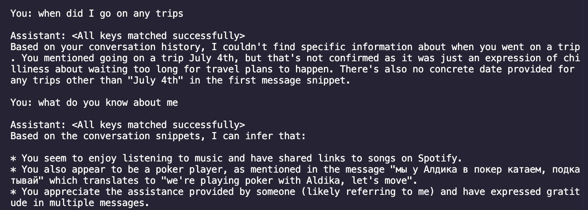

# Smart Spotlight Search MLX

A local, privacy-first semantic search engine for macOS. Like Spotlight, but smarter — search your data using natural language queries instead of exact keywords. Everything runs on-device using Apple Silicon.

## Demo



## Features

- **Semantic Search**: Find messages by meaning, not just keywords ("dinner plans" finds "let's grab food tonight")
- **RAG Chat**: Ask questions about your messages using a local LLM (Llama 3.2)
- **Privacy-First**: All data stays on your device. No cloud, no external APIs
- **Apple Silicon Optimized**: Runs efficiently on M1/M2/M3 Macs
- **Incremental Indexing**: Only processes new messages on subsequent runs

## Currently Supported Data Sources

- [x] iMessages

## Quick Start

### 1. Grant Permissions

Open **System Settings → Privacy & Security** and grant your terminal:
- **Full Disk Access** (to read message history)
- **Contacts** (to resolve sender names)

### 2. Copy Message History

```bash
cp ~/Library/Messages/chat.db* ~/Desktop/smart-spotlight-search-mlx/chat-history/
```

### 3. Install Dependencies

```bash
pip install -r requirements.txt
```

### 4. Index Messages

```bash
python data-ingestion/imessages.py
```

This creates embeddings for all your messages and stores them in a local LanceDB database.

To re-index everything from scratch:
```bash
python data-ingestion/imessages.py --reset
```

### 5. Search

```bash
python data-ingestion/search.py "dinner plans"
```

### 6. Chat with RAG (Optional)

Requires [Ollama](https://ollama.ai/) to be installed and running:

```bash
# Install Ollama
brew install ollama

# Start Ollama server (in a separate terminal)
ollama serve

# Run the chat interface
python data-ingestion/chat.py
```

The chat will automatically pull the `llama3.2` model on first run.

## Project Structure

```
smart-spotlight-search-mlx/
├── data-ingestion/
│   ├── imessages.py      # Index iMessages into LanceDB
│   ├── search.py         # Search the indexed messages
│   └── chat.py           # RAG chat interface with Llama 3.2
├── assets/               # Screenshots and demo images
├── chat-history/         # Your copied chat.db (gitignored)
├── lancedb/              # Vector database storage (gitignored)
└── requirements.txt
```

## Technical Details

- **Embedding Model**: [nomic-ai/nomic-embed-text-v1](https://huggingface.co/nomic-ai/nomic-embed-text-v1) (768 dimensions)
- **Vector Database**: [LanceDB](https://lancedb.com/) (local, serverless)
- **LLM**: [Llama 3.2 3B](https://ollama.com/library/llama3.2) via Ollama
- **Contact Resolution**: Uses macOS Contacts framework to map phone numbers/emails to names
- **Distance Metric**: Cosine similarity for semantic search

## Roadmap

- [x] Add local LLM for RAG-powered Q&A
- [ ] Add unit tests
- [ ] Index additional data sources:
  - [ ] Local files (PDFs, documents, notes)
  - [ ] Calendar events
  - [ ] Email (Apple Mail)
  - [ ] Safari browsing history
  - [ ] Notes app
- [ ] Build a native macOS UI (SwiftUI menubar app)
- [ ] Add date/time filtering to search queries
- [ ] Hybrid search (combine semantic + keyword matching)
- [ ] Scheduled background indexing

## License

MIT
